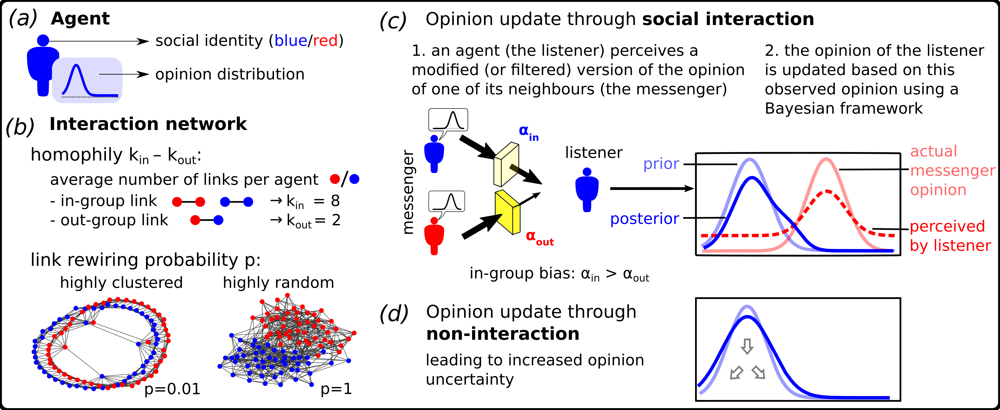
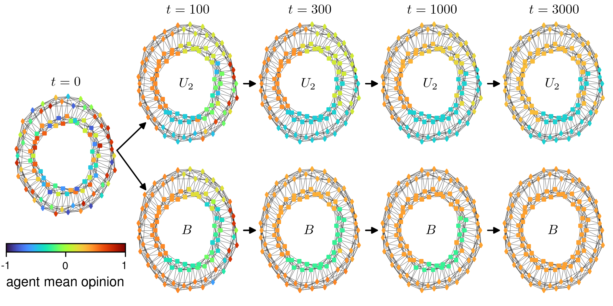

# Opinion formation model with social identity and in-group bias

This is an agent-based model to study the effect of social identity and in-group bias on consensus formation in virtual societies. 

The schematic below shows the main processes and parameters of the model. For a detailed model description see [todo:insert link to manuscript]

<p align="center">
  
</p>

The model produces opinion patterns that may look as follows for a society $U_2$ of agents unaffected or a society $B$ of agents affected by in-group biases. 

<p align="center">
  
</p>

## Usage

For a single run, use
```
python model.py 
```

Run time (on a normal laptop): ca. 20 sec

## Batch runs

For batch simulations use 
```
.\run.sh n k k_in k_out delta_0 kappa communication_frequency sig_op_0 p_rewire T resolution seed 
```
where T is the time horizon and resolution can be "high" for the full range of in- and out-group perception parameters $\alpha_{\rm in/out} \in [0,1[$ or "low" for $\alpha_{\rm in/out} \in \{ {\rm U1}(0.25, 0.25), \ {\rm U2}(0.5,0.5), \ {\rm U3}(0.75,0.75), \ {\rm B}(0.75,0.25)\}$.

To reproduce the results in the main article run: 
```
.\run.sh 100 10 8 2 0.0 0.0002 0.2 0.2 0.0 5000 low 420 
```
In the article, we vary `p_rewire' between 0 and 1 and use 1000 random seeds.

## Parameters

| Parameter | Description | Default value |
|-----|-----|-----|
| n_agents | number of agents | 100 |
| k | average node degree per agent | 10 |
| k_in | average number of in-group links per agent $k_{\rm in}$* | 8 |
| k_out | average number of out-group links per agent $k_{\rm out}$ | 2 |
| a_ins | in-group perception values | 0.1,0.2,0.3,...,0.8,0.9,0.99 |
| a_outs | out-group perception values. Note, only values smaller or equal than in-group perception are simulated | 0.1,0.2,0.3,...,0.8,0.9,0.99 |
| sig_op_0 | fixed initial opinion uncertainty of the agents | 0.2 |
| communication_frequency | probability to interact and be socially influenced at each time step | 0.2 |
| kappa | diffusion strength during non-interaction | 0.0002 |
| delta_0 | predisposition for a social identity group to have an opinion in the upper half of the opinion space. This is not used in the main manuscript | 0.0 |
| p_rewire | the randomness in the network | 0.0 |
| track_times | times at which the simulation tracks the agent mean opinions, the standard deviation. Consensus time and mean consensus opinion are stored regardless of this. | [0,5000] |
| seed | random seed | |

* One can summarise $k_{in}$ and $k_{out}$ as the degree of homophily $h=\frac{k_{\rm in} - k_{\rm out} }{k}=0.6$

## Python Libraries and Dependencies 

| Package  | Version |
|-----|-----|
| python | 3.9.5 |
| see environment.yml | |


## Netlogo

For interested people who prefer netlogo over python, we have also implemented a version in netlogo. 
**Disclaimer**: Unlike the python version, this has not been thoroughly tested and should be used with caution.


